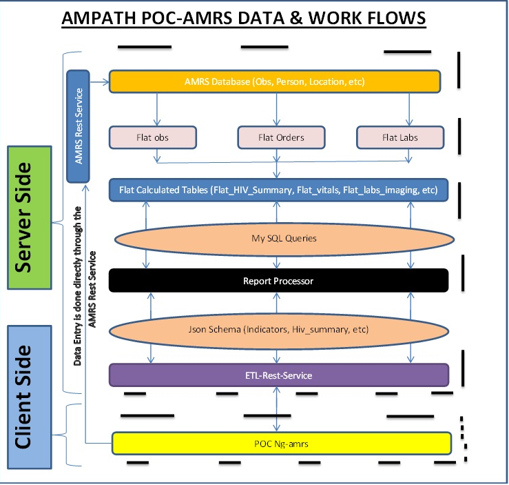

# OpenMRS ETL
> ETL (Extract, Transform and Load) is a process in data warehousing responsible for pulling data out of the source systems and placing it into a data warehouse. For more information about ETL go to http://datawarehouse4u.info/ETL-process.html

This project is responsible for the first 2 layers of ETL i.e ET (Extract, Transform) while L (Load) is handled by a different project (https://github.com/AMPATH/etl-rest-server)
The diagram below shows you the entire lifecycle of openmrs data from  Extraction to Transformation to Loading


## Getting Started

Create an empty database called 'etl'
```sh
create database etl;
```

clone the repository and run this command
```sh
cd /etl/etl/
git pull origin master 
```

Open up a screen(sudo apt-get install screen) using the below command: 
```sh
screen -r
```
Run this commands sequentially in that order (please use latest version of each script. See etl/database_updates/update_flat_tables_and_calculated_tables)
Each scripts takes a couple of seconds to hours depending with the amount of data in openmrs db
```sh
mysql etl < ../flat_tables/flat_obs_v1.3.sql
mysql etl < ../flat_tables/flat_orders_v1.0.sql
mysql etl < ../flat_tables/flat_lab_obs_v1.2.sql
mysql etl < ../calculated_tables/hiv_summary_v2.12.sql
mysql etl < ../calculated_tables/labs_and_imaging_v2.5.sql
mysql etl < ../calculated_tables/vitals_v2.0.sql
mysql etl < ../calculated_tables/hiv_vl_summary_v1.0.sql
mysql etl < ../calculated_tables/pep_summary_v1.0.sql
mysql etl < ../calculated_tables/defaulters_v2.3.sql

```

After all the tasks are completed, schedule the syncing process.
## Scheduling Syncing Process
The syncing process allows ETL process to run after every 5 minutes or (x minutes). This facilitate access of data  in realtime (5 minutes delay) as data are inserted and updated on base db (openmrs/amrs) 
Run the following commands
```sh
screen -r
cd /etl/etl/
git pull origin master
chmod +x database_updates/*
crontab -e
```
when you run crontab -e a nano editor will open up. paste this code

```sh
37 5-20 * * 1-5 ~/etl/etl/database_updates/update_calculated_tables_hourly
0-59/5 5-20 * * 1-5 /home/etl/etl/etl/database_updates/update_flat_tables_and_calculated_tables > etl_log
```
to understand more about cronjobs, please see https://help.ubuntu.com/community/CronHowto

## Contributing

1. Fork it!
2. Create your feature branch: `git checkout -b my-new-feature`
    > While making changes, If you add any new column to any flat table, please remember to create a new script file. Don't modify the current version. 
    > You also need to test and verify your result using test server by running changed scripts individually 
3. Commit your changes: `git commit -am 'Add some feature'`
4. Push to the branch: `git push origin my-new-feature`
5. Submit a pull request :D
6. Rebuild the changes
    * Log in to ETL server
    * Before rebuilding please ensure you shut down the syncing process (cronjob). Here is how to do this:
        ```sh
        screen -r
        crontab -e
        ```
    * then comment out these lines using #:
        ```sh
        #37 5-20 * * 1-5 ~/etl/etl/database_updates/update_calculated_tables_hourly
        #0-59/5 5-20 * * 1-5 /home/etl/etl/etl/database_updates/update_flat_tables_and_calculated_tables > etl_log
        ```
    * After shutting down cronjob, you need to backup the previous version of flat table before rebuilding it afresh by:
        ```sh
       mysql -u xxx
       ALTER TABLE `etl`.`flat_hiv_summary` RENAME TO  `etl`.`flat_hiv_summary_20_05_2017` ;
       DROP TABLE `etl`.`flat_hiv_summary`;
        ```
    * After Backing up, run the rebuilding process by using these commands (this is an example for edited hiv_summary_v2.x.sql)
        ```sh
        screen -r
        cd /etl/etl/
        git pull origin master
        chmod +x database_updates/*
        mysql etl < ../calculated_tables/hiv_summary_v2.x.sql
        ```
    * Finally  after rebuilding processes, turn back on syncing by uncommenting the 2 lines.

## Monitoring and logging
All successful builds and syncing metadata are stored in a table called flat_log
```sh
    select * from etl.flat_log  where table_name = 'flat_obs_v1.2' order by seconds_to_complete desc limit 50
```
    
## Backing Up
You always need to back up flat tables before any rebuilding process. Anything can happen!
```sh
ALTER TABLE `etl`.`flat_orders` RENAME TO  `etl`.`flat_orders_backup_20_05_2017` ;
```

# Release History
## Flat Obs Release History
* v1.0 Notes:
    * added encounter types: 1,2,3,4,5,6,7,8,9,10,13,14,15,17,19,22,23,26,43,47,21
    * Replace flat_obs with flat_obs_name
    * Replace concept_id in () with concept_id in (obs concept_ids)
    * Add column definitions
    * Add obs_set column definitions

* v1.1 Notes:
    * Added visit_id. This makes it easier to query for visits related indicators
    
* v1.3 Notes:
    * Added updated encounter tracking when updating flat_obs
    * Removed voided patients data from flat_obs

## Flat HIV Summary Release History
*  v2.1 Notes:
    * Updated out_of_care to include untraceable
    * Added tb_prophylaxis_start_date
    * Updated patient_care_status to be more inclusive of other status questions
    * Fixed problem with next_clinic_datetime_hiv

*  v2.2 Notes:
    * Added encounter types for GENERALNOTE (112), CLINICREVIEW (113), MOH257BLUECARD (114), HEIFOLLOWUP (115), TRANSFERFORM (116)

*  v2.3 Notes:
    * Added arv_first_regimen_start_date and arv_start_location. This makes it easier to query for the cumulative ever indicator
    * Added visit_id This makes it easier to query  visits related indicators eg scheduled, unscheduled
    * Added prev_clinical_rtc_date_hiv and next_clinical_rtc_date_hiv this required for creating outreach dataset


*  v2.4 Notes:
    * Corrected Errors with definations for vl_1 and vl_2

*  v2.5 Notes:
    * Changed the definition arv_start_date  to account for regimen changes
    * Added prev_arv_start_date track when they stared the previous regimen
    * Added prev_arv_end_date to track when they stopped the previous regimen
    * Added prev_arv_line to track the arv line the patient was previously on
    * Added prev_arv_meds to track the arv medications the patient was previously on
    * Fixed arv_start_date and arv_first_regimen_start_date

*  v2.7 Notes:
    * This indicators were added inorder to produce vl supression assesment report
    * Added hiv_status_disclosed indicator
    * Added prev_arv_adherence, cur_arv_adherence indicators
    * Added prev_vl_1_date and prev_vl_1
    * fixed cur_clinic_datetime to include NONCLINICALENCOUNTER Encounter type

*  v2.8 Notes:
    * Removed prev_vl_1_date and prev_vl_1
    * Fixed vl_2 and vl_2_date

*  v2.9 Notes:
    * Added tb_prophylaxis_end_date and modified tb_prophylaxis_start_date
    * fixed tb_tx_start_date defintion

*  v2.10 Notes:
    *  added encounter type 120 to is_clinical_encounter
    *  added encounter type index so that flat_defaulters can execute much faster
    *  added tb_screening_result indicator
    *  added index for location_uuid_rtc_date
    *  added hiv_exposed_occupational and pep_start_date

*  v2.11 Notes:
    *  Added encounter date_change tracking to update patients whose encounter
    *  data changes without affecting obs or orders eg a change in encounter location
    *  removed PEP indicators (hiv_exposed_occupational and pep_start_date) from this flat table: this was affecting hiv active in care.

* v2.12 Notes:
    *  added encounter type 127 and 128 to is_clinical_encounter
    *  Added Concept TRANSFER CARE TO OTHER CENTER to transfer_out indicator
    *  Added ability to rebuild/sync at any day of the week
    *  Added ability to continue rebuilding in case of an error
    *  Renamed new_data_person_ids table to flat_hiv_summary_queue and made it permanent
    *  Added 1594 (PATIENT TRANSFERRED OUT) to transfer_out indicator

